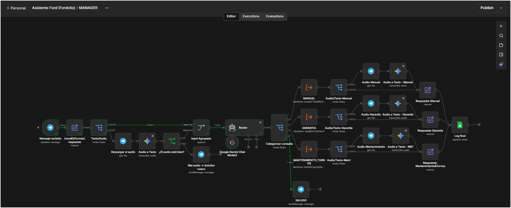
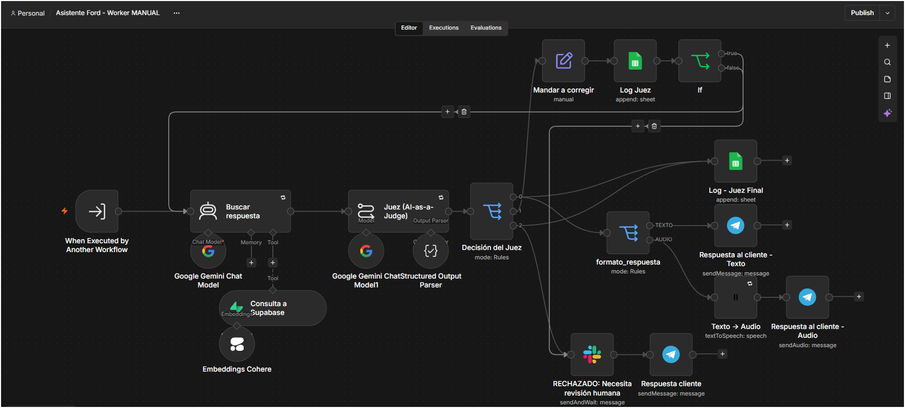
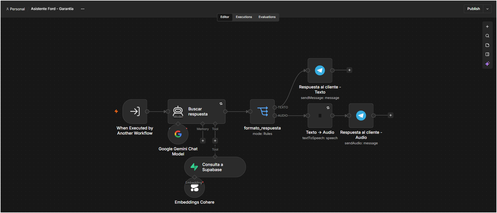
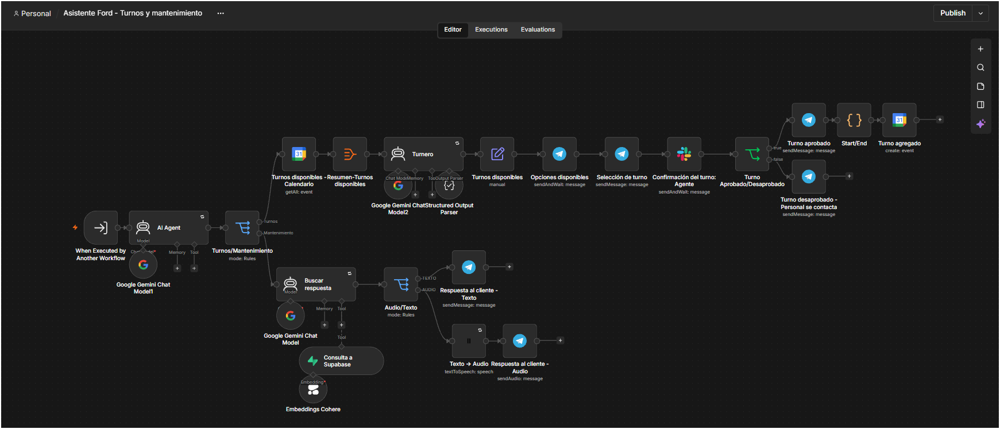
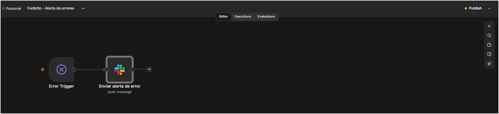
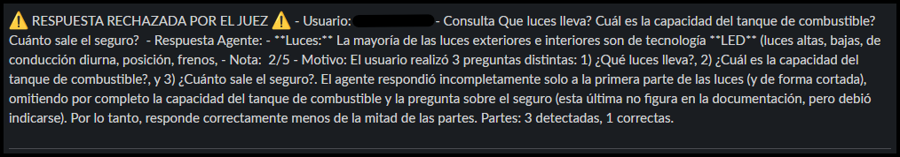
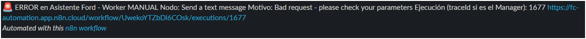

# FORDCITO: asistente de posventa Ford Territory

Sistema multi-agente en n8n que atiende por Telegram, con texto o voz, las consultas de posventa de un concesionario: manual del usuario, garantía, plan de mantenimiento y turnos. Cada respuesta técnica del manual es auditada por un segundo agente (AI-as-a-Judge) antes de llegar al cliente.

Proyecto Final Integrador, curso AI Automation (Coderhouse). Autor: Facundo Ezequiel Cabanilla.

## En 30 segundos

- **Problema:** un concesionario recibe unas 1.200 consultas por mes y atenderlas a mano lleva unas 100 horas.
- **Qué hace:** responde en segundos, con datos de la documentación oficial, en el mismo formato en que escribió el cliente (texto o voz).
- **Cómo lo hace:** un Manager clasifica cada mensaje y lo deriva a un Worker especializado (manual, garantía, mantenimiento y turnos).
- **Resultado estimado:** unas 81 horas liberadas por mes y un costo de unos USD 147 contra USD 500 de la atención manual, un ahorro cercano a USD 353 mensuales. Son estimaciones con los supuestos detallados en el documento del proyecto.

## Puntos fuertes

- **Auditoría automática:** el Juez puntúa cada respuesta del manual de 1 a 5. Si es 3 se autocorrige hasta 2 veces; si es 2 o menos, la deriva a una persona por Slack.
- **Humano en el circuito:** los rechazos y la creación de turnos pasan por una aprobación humana antes de llegar al cliente o al calendario.
- **Trazabilidad:** cada consulta lleva un `traceId` único y queda registrada en Google Sheets.
- **Resiliencia:** un workflow de alertas avisa por Slack ante cualquier falla, y los nodos de lectura reintentan con espera.
- **Texto y voz:** transcribe audios y responde en audio cuando el cliente escribió por voz.
- **Stack freemium:** el prototipo funciona con capas gratuitas de los proveedores.

## Capturas

| | |
|---|---|
| Manager |  |
| Worker MANUAL (con el Juez) |  |
| Worker Garantía |  |
| Worker Turnos y mantenimiento |  |
| Workflow de alertas |  |
| Rechazo derivado a Slack |  |
| Alerta real de error |  |

## Arquitectura

Un Manager recibe el mensaje, lo clasifica y delega en un Worker especializado. Cada petición lleva un `traceId` (el ID de ejecución del Manager) para poder reconstruirla de punta a punta.

| Archivo | Rol | Qué hace |
|---|---|---|
| `Asistente Ford (Fordcito) - MANAGER.json` | Manager | Recibe Telegram, transcribe audios, clasifica la intención y registra en Google Sheets |
| `Asistente Ford (Fordcito) - Worker MANUAL.json` | Worker 1 | Responde con el manual (RAG), lo audita el Juez, se autocorrige hasta 2 veces y deriva a una persona en Slack si no alcanza |
| `Asistente Ford (Fordcito) - Garantía.json` | Worker 2 | Responde sobre garantía con base vectorial propia; si no hay respaldo, responde "No sé" |
| `Asistente Ford (Fordcito) - Turnos y mantenimiento.json` | Worker 3 | Consultas de mantenimiento y pedido de turnos con aprobación humana en Slack y evento en Google Calendar |
| `Asistente Ford (Fordcito) - Alerta de errores.json` | Soporte | Se activa ante cualquier falla y avisa por Slack con workflow, nodo, error y enlace a la ejecución |

Contrato entre el Manager y los Workers (4 parámetros): `traceID`, `Consulta`, `chatID`, `formato_respuesta`.

## AI-as-a-Judge (rama Manual)

El Juez puntúa la `exactitud_factual` de 1 a 5 contra el contexto recuperado:

- 4 o 5: ACEPTADO, se envía al cliente.
- 3: CORREGIR, el agente reintenta guiado por la crítica (máximo 2 veces).
- 1 o 2: RECHAZADO, se deriva a una persona por Slack y su respuesta llega al cliente por Telegram.

Cada evaluación se guarda en Google Sheets con `traceId`, `timestamp`, `systemPromptSnapshot`, nota, veredicto y crítica.

## Cómo importarlo

1. En n8n: *Workflows > Import from file*, uno por uno. Importá primero los tres Workers y el workflow de alertas, y por último el Manager.
2. Reasigná las credenciales (los archivos solo contienen sus nombres, no claves):
   - Telegram, Google Gemini, Cohere, ElevenLabs, Supabase, Slack, Google Sheets y Google Calendar.
3. Creá en Supabase las dos tablas con `id` (uuid), `content` (texto), `metadata` (jsonb) y `embedding` (vector de 1024 dimensiones): `document_chunks` y `document_garantia_chunks`, con las funciones `match_documents` y `match_document_garantia_chunks`.
4. En cada Execute Workflow del Manager, apuntá al Worker importado. En los 4 workflows de negocio, elegí "Asistente Ford (Fordcito) - Alerta de errores" como Error Workflow.
5. Publicá todos los workflows (el de alertas también, o no se puede seleccionar).

## Limitaciones conocidas

- El Juez solo supervisa la rama Manual y evalúa contra el contexto recuperado: si la búsqueda falla, no puede detectarlo.
- Los embeddings (Cohere `embed-english-v3.0`) son de un modelo en inglés sobre documentos en español.
- Las respuestas no citan la página del manual.
- Sin memoria conversacional ni deduplicación de mensajes.
- El límite de longitud de las respuestas es una instrucción del prompt, no un control técnico.

El detalle completo, las rúbricas, el modelo de ROI y los casos de prueba están en el documento del proyecto (`Cabanilla_Facundo_ProyectoFinal_AI_Experto.pdf`).

## Seguridad

Los workflows no incluyen claves ni tokens: solo referencias a credenciales por nombre. Los identificadores de chat se generan en cada conversación.
